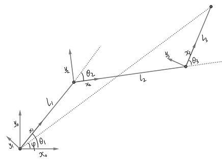

# 三自由度机械臂

## 算法

设终点坐标(相对于x0-y0坐标系)为(x, y)。利用正向运动学，可得如下关系

$$
\phi=\theta_1+\theta_2+\theta_3=\text{atan2}(y, x),
$$
以及

$$
\left(
\begin{matrix}
x \\
y \\
0 \\
1 \\
\end{matrix}
\right)=^0_3T\left(
\begin{matrix}
l_3 \\
0 \\
0 \\
1 \\
\end{matrix}
\right),
$$
其中

$$
^3_0T=\left(
\begin{matrix}
\cos \phi& -\sin\phi & 0 & l_1\cos\theta_1+l_2\cos(\theta1+\theta_2) \\
\sin\phi& \cos\phi & 0 & l_1\sin\theta_1+l_2\sin(\theta1+\theta_2) \\
0 & 0 & 1 & 0 \\
0 & 0 & 0 & 1 \\
\end{matrix}
\right).
$$
由此可得

$$
\begin{align}
& \theta_1+\theta_2=2\tan^{-1}(\frac{b+\sqrt{a^2+b^2-c^2}}{a+c}),\\
& \theta_1 = \text{acos}(\frac{x-l_3\cos\phi-l_2\cos(\theta_1+\theta_2)}{l_1}),
\end{align}
$$
其中

$$
\begin{align}
& a=2l_2(x-l_3\cos\phi) ,\\
& b= 2l_2(y-l_3\sin\phi), \\
& c= x^2+y^2+l_2^2+l_3^2-l_1^2-2l_3(x\cos\phi+y\sin\phi).
\end{align}
$$
由以上结果就可以得到$\theta_1, \theta_2, \theta_3$。然后利用正向运动学即可得到节点处的坐标，从而绘制出图形。

## Demo

机械臂跟随鼠标当前位置，[demo](https://jiandandaoxingfu.github.io/point-tracking)。

## 参考资料 

- 知乎专栏：[何小白：机器人学学习笔记](https://zhuanlan.zhihu.com/c_1208050340920299520).

## 问题
- 当theta1， theta2达到临界值(180, 0, -180)时，无法正确跟踪目标点。