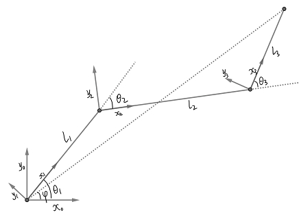

<!-- MarkdownTOC -->

- [平面三自由度机械臂](#%E5%B9%B3%E9%9D%A2%E4%B8%89%E8%87%AA%E7%94%B1%E5%BA%A6%E6%9C%BA%E6%A2%B0%E8%87%82)
	- [算法](#%E7%AE%97%E6%B3%95)
		- [正向运动学与逆向运动学](#%E6%AD%A3%E5%90%91%E8%BF%90%E5%8A%A8%E5%AD%A6%E4%B8%8E%E9%80%86%E5%90%91%E8%BF%90%E5%8A%A8%E5%AD%A6)
		- [路径规划](#%E8%B7%AF%E5%BE%84%E8%A7%84%E5%88%92)
		- [三维四自由度机械臂](#%E4%B8%89%E7%BB%B4%E5%9B%9B%E8%87%AA%E7%94%B1%E5%BA%A6%E6%9C%BA%E6%A2%B0%E8%87%82)
	- [Demo](#demo)
	- [参考资料 & 致谢](#%E5%8F%82%E8%80%83%E8%B5%84%E6%96%99--%E8%87%B4%E8%B0%A2)
	- [问题](#%E9%97%AE%E9%A2%98)

<!-- /MarkdownTOC -->
[TOC]

# 平面三自由度机械臂

## 算法

### 正向运动学与逆向运动学

关键在于DH表示法的引入(实质是坐标架之间的变换矩阵)。

设终点坐标(相对于x_0-y_0坐标系)为(x, y)。利用正向运动学，可得如下关系

以及

其中

由此可得

其中

由以上算法，我们可以根据末端坐标得到三个角度值(逆运动学)。也可以利用三个角度值(顺运动学)，绘制机械臂。

### 路径规划

上面考虑了从一个点到另一个点，这里我们还要考虑如何过去。这里我们对末端点的路径进行规划。考虑最简单的情形，即路径为折线段，如下图

两个圆之间为末端点运动空间。P为起始点，Q为终点，路径分两种情况：P --> Q', P --> M --> Q。其中M是两条切线的交点。需要注意的是后一种情况并非最短路(最短路应该是中间部分沿两切点之间的圆弧)。M的求解点到直线的距离，圆的切线及切线交点等。

​	此外，我们还可以考虑速度，加速度。考虑到实际情况，应该有P,M,Q(Q')的速度是0。

### 三维四自由度机械臂

我们可以将平面三自由度机械臂推广到如下的三维四自由度机械臂，

其中从上倒下，第一个杆可以左右旋转，上面三个可以上下旋转且始终在一个平面内。

​	首先，我们求末端位置(相对于frame-0)转化为相对于frame-1。此时相当于平面三自由度问题。

## Demo

[Demo](https://jiandandaoxingfu.github.io/point-tracking).

## 参考资料 & 致谢

- 知乎专栏：[何小白：机器人学学习笔记](https://zhuanlan.zhihu.com/c_1208050340920299520).
- Github：[Robot Arm Manipulator.](https://github.com/jiandandaoxingfu/Interactive_Graphics)

## 问题
- 当theta1， theta2达到临界值(180, 0, -180)时，无法正确跟踪目标点。
- 路径规划中当M跑出大圆外，则需要重新规划。
